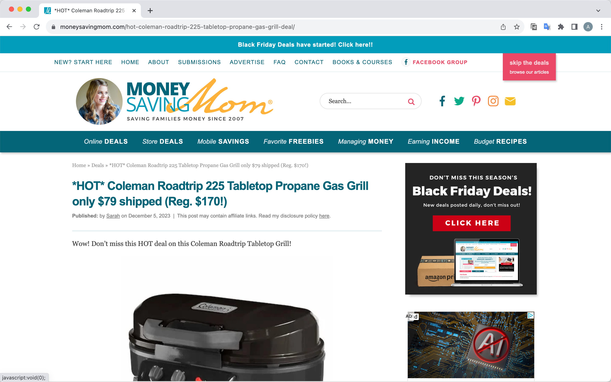

# Final Project Report

* Student Name: Alyssa Nuanxin Jin
* Github Username: Alyssajin
* Semester: Fall 2023
* Course: CS 5001


## Description 
General overview of the project, what you did, why you did it, etc. 

### **Purpose**
Present Oil prices as a graph with the latest news on one HTML page.
This page allows users to select their desired types of oil and input date ranges to search prices.

### **Background**
News pushes prices to fluctuate. Reviewing historical information and prices is one of the critical strategies for predicting future price movements. However, manually collecting news and prices from different sources and presenting them is quite handy. This application assists users by showing all the information at once. 

### **Goals**
- Fetch news and oil prices from authentic websites.
- Allow users to search oil prices and the latest news.
- Display oil prices in a user-friendly interface, such as a graph.
- Enable users to dive into the details of news by clicking.

### **To achieve these goals**
- I fetch data of {latest news, oil prices} by using APIs from the NEWS API website and EIA.
- I parse data by using different functions.
- I use Plotly to draw a graph for the oil prices.
- I utilise Django to construct a web page.
- I apply unittest and mock functions to test codes.

## Key Features
Highlight some key features of this project that you want to show off/talk about/focus on. 

### **Key Features**
- Allow interactions with users: Different data will be returned according to users' inputs.  
- Extract and parse data from API websites.
- Use html language to stylish a simple page, including a bar, a selection list, a button and input areas.

### **Key files**
- [data.py](django_project/oil/data.py): fetch and parse data.
- views.py: assemble processed data for home.html
- home.html: display features on the home page.
- test_data.py: test data.py
- test_graph_actual.png & test_graph_expected.png: test the draw_graph function.
- oil_data.json & news_data.json: fake data for test_data.py


## Guide
How do we run your project? What should we do to see it in action? - Note this isn't installing, this is actual use of the project.. If it is a website, you can point towards the gui, use screenshots, etc talking about features. 

### **Running the Application**

1. Open a terminal/command prompt. Navigate to the project directory - 'django_project' containing 'manage.py' file. Run the command bellowed:
```python
python manage.py runserver
```
2. Click on "http://127.0.0.1:8000/" and visit this web page. The page with a graph of oil prices and a bar of oil news will be displayed.
3. You can scroll down the Product selection list to choose a kind of oil product, fill in the form with your desired start time and end start for searching. Then click "Submit" to retrieve price data and news data. The price graph and news of your desired product will be presented. You do not to input a value in every form, as a default value will be displayed.

### **Steps**
1. Visit "http://127.0.0.1:8000/". You will see the home page.

2. Scroll down the product selection list and choose one.

3. Input the start date and the end date. Click the submit button.

4. The information labelled in red squares will change according to input values.

5. Click on the title of news and the page will jump to the original website of the news. Shown below.


## Installation Instructions
If we wanted to run this project locally, what would we need to do?  If we need to get API key's include that information, and also command line startup commands to execute the project. If you have a lot of dependencies, you can also include a requirements.txt file, but make sure to include that we need to run `pip install -r requirements.txt` or something similar.

`pip install -r requirements.txt` 


## Code Review
Go over key aspects of code in this section. Both link to the file, include snippets in this report (make sure to use the [coding blocks](https://github.com/adam-p/markdown-here/wiki/Markdown-Cheatsheet#code)).  Grading wise, we are looking for that you understand your code and what you did.

### **‘[fetch_form_value](fetch_api_data)’**:
_To read and store value from user. From views.py_

```python
def fetch_form_value() -> tuple:
    """
    Get search range from users' input.

    :return: (starting_date, ending_date, user_input)
    """
    starting_date = request.POST.get('starting_date')
    ending_date = request.POST.get('ending_date')
    product_name = request.POST.get('product_name')
    return starting_date, ending_date, product_name
```
‘starting_date’ and ‘ending_date’ are values from the form, while ‘product_name’ is the value from the scroll-down selection list. I employ ‘request.POST.get()’ to extract users' input values.

### **'process_news'** :
_Store titles, articles, dates and urls of news. From data.py_

```python
def process_news(data: dict) -> tuple or str:
    """
    Process news from fetch_news function.
    if the product has news, return (titles, descriptions, and dates) of the top 3 news.
    If not, return 'No news'

    :param data: data for processing
    :return: ([Top_1 titles, Top_2 titles, ...], [Top_1 descriptions, ...], [Top_1 dates,...]) or 'No news'
    """
    # Get a list of news info
    news = clean_news(data)
    # Initialize a article list, a title list, a date list and a url list.
    three_articles = []
    three_articles_title = []
    three_articles_date = []
    three_articles_url = []
    try:
        # Choose the top 3 popular articles and their related infos into lists
        for article_num in range(3):
            articles = news[article_num]['description']
            titles = news[article_num]['title']
            dates = f"{news[article_num]['publishedAt']}"
            urls = news[article_num]['url']
            # Store descriptions of the Top 3 news into three_articles
            three_articles.append(articles)
            # Store titles of the Top 3 news into three_articles_titles
            three_articles_title.append(titles)
            # Store dates pf the Top 3 news into three_articles_date
            three_articles_date.append(dates)
            # Store urls of the Top 3 news into three_articles_url
            three_articles_url.append(urls)
        return three_articles_title, three_articles, three_articles_date, three_articles_url
    # If there is no news related to the product, return No news.
    except IndexError:
        return 'No news'
```
I use a For loop to go through the first 3 news data. In the loop, I extract different values into four lists. Try Except function is implemented to detect an IndexError(if the number of news is 0 or fewer than 3). The processed data will be returned as a tuple.

### **'draw_graph'**:
_Display data in a graph. From data.py_

```python
def draw_graph(data: dict, product_name: str = 'Brent'):
    """
    Draw a graph according to the oil price.
    :param data: data for the graph
    :param product_name: product name

    :return: None
    """
    # x_data is date value
    x_value = process_oil_data(data=data)[1]
    x_data = np.array(x_value)
    # y_data is price value
    y_value = process_oil_data(data=data)[0]
    y_data = np.array(y_value)
    trace = go.Scatter(x=x_data, y=y_data, mode='lines', name='lines')
    # Set layout
    layout = dict(
        title={
            'text': f'{product_name} Price',
            'y': 0.9,
            'x': 0.5,
            'xanchor': 'center',
            'yanchor': 'top'
            },
        xaxis_title='Period',
        yaxis_title=get_product_unit(product_name),
        xaxis=dict(
            showline=True,
            showgrid=False,
            showticklabels=True,
            linecolor='rgb(204, 204, 204)',
            linewidth=2,
            ticks='outside',
            tickfont=dict(
                family='Arial',
                size=12,
                color='rgb(82, 82, 82)',
            ),
        ),
        yaxis=dict(
            showline=True,
            showgrid=False,
            showticklabels=True,
            linecolor='rgb(204, 204, 204)',
            linewidth=2,
            zeroline=False,
            ticks='outside',
            tickfont=dict(
                family='Arial',
                size=12,
                color='rgb(82, 82, 82)',
            ),
        ),
        autosize=False,
        margin=dict(
            autoexpand=False,
            l=100,
            r=20,
            t=110,
        ),
        showlegend=False,
        plot_bgcolor='white'
    )
    # Get the figure
    fig = go.Figure(data=[trace], layout=layout)
    return fig
```
I employ Plotly to construct a graph. The NumPy function is used to store the x-value and y-value, as the NumPy array is more memory-efficient than a list and it is the required data type of Plotly. Then 'plotly.graph_objects' function is applied to form a graph. The data type of layout is designed as a dictionary according to requirements from Plotly.


### Major Challenges
Key aspects could include pieces that your struggled on and/or pieces that you are proud of and want to show off.

- Self-learned and constructed a web page by using Django and HTML. 
- Self-learned and drawn a graph by using Plotly.


## Example Runs
Explain how you documented running the project, and what we need to look for in your repository (text output from the project, small videos, links to videos on youtube of you running it, etc)

## Testing
How did you test your code? What did you do to make sure your code was correct? If you wrote unit tests, you can link to them here. If you did run tests, make sure you document them as text files, and include them in your submission. 

- All functions except the draw_graph functions haven been tested by test_data.py.  [django_project/test_data.py](django_project/test_data.py)
- draw_graph functions has been tested by comparing the actual data graph with the expected data graph.


## Missing Features / What's Next
Focus on what you didn't get to do, and what you would do if you had more time, or things you would implement in the future. 

## Final Reflection
Write at least a paragraph about your experience in this course. What did you learn? What do you need to do to learn more? Key takeaways? etc.
